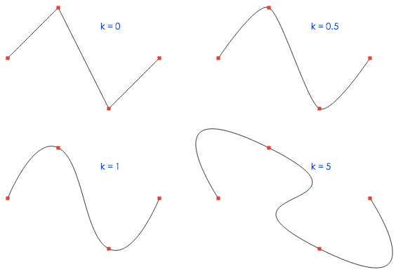
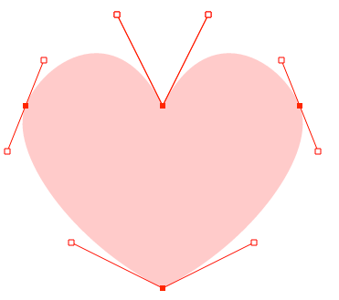
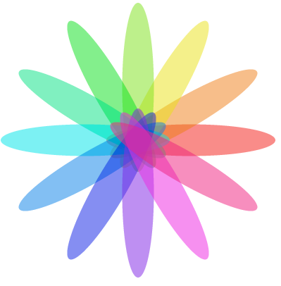
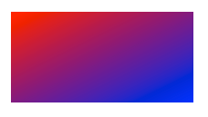
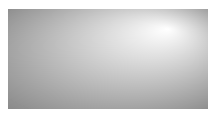
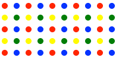
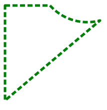

# Kity Graphic : Get Started

本文档简单介绍 Kity Graphic 中的概念和使用

## 基础框架

简单介绍 Kity Graphic 的设计。

### Class 系统

Kity Graphic 使用 OOP 的编程和接口风格，通过创建对象和在对象上进行操作来实现图形的绘制、移动、更新、动画、交互等功能。

用户可以通过继承现有的类来封装更多所需要的图形，用以复用。

关于 Kity Class 系统的更详细文档，请参考 [Kity Graphic OOP.md](kity-graphic-oop.md) (还没写，别着急点)

### Pipe 函数

所有 Kity Graphic 的对象都有一个 `pipe` 函数，它做的事情很简单：接收一个函数 fn，这个函数会被调用，并且调用的上下文以及第一个参数都是当前对象。这个函数可以让对对象的一连串操作整理的干净起来。

下面是不使用 `pipe` 函数绘制一个用渐变填充、虚线描边并且旋转了30度的矩形的代码。

```js
var paper = new Paper(document.body);
var rect = new Rect(0, 0, 10, 10);
var brush = new LinearGradientBrush();

brush.addStop(0, new Color('red'));
brush.addStop(0.5, new Color('yellow'));
brush.addStop(1, new Color('blue'));
paper.addResource( this );
rect.fill( brush );

var pen = new Pen();
pen.setDashArray([2, 2]);
pen.setWidth(1);
pen.setColor('gray');
rect.stroke( pen );

rect.rotate(30);
```
    
这个代码看起来还行，不过对比一下使用 `pipe` 函数的版本：

```js
var paper = new Paper(document.body);

paper.addShape(new Rect(0, 0, 10, 10).pipe( function() {

    this.fill(new LinearGradientBrush.pipe( function( brush ) {
        brush.addStop(0, new Color('red'));
        brush.addStop(0.5, new Color('blue'));
        brush.addStop(1, new Color('yellow'));
        paper.addResource(brush);
    }));
    
    this.stroke(new Pen().pipe( function( pen ) {
        pen.setDashArray([2, 2]);
        pen.setWidth(1);
        pen.setColor('gray');
    }));
    
    this.rotate(30);
    
}));
```
    
恰当地使用 `pipe` 函数，可以提高代码的可读性和美观性。


## 使用 Paper ##

Paper 是所有图形和资源的跟容器，所有图形和资源（资源的概念请参照“Resources”）由 Paper 集中管理。

### 初始化 Paper

Kity 中所有的对象都是通过使用 new 运算符创建的，有一些类型要求你在创建的时候传递必须的参数到构造函数中。用下面的代码可以创建一个 Paper，并且会在指定的容器中渲染：

```js
var paper = new Paper('container');

// 或者直接传 Dom 对象：
var paper = new Paper(document.body);
```

如果需要，你也可以重新获取容器：

```js
var container = paper.getContainer();
```
    
### 设置宽高和视野

宽高和视野是对 Paper 最基本的设置。

宽高指的是 Paper 在浏览器中渲染的大小，可以使用像素或百分比作为单位：

```js
paper.setWidth(800).setHeight(600);
// 或使用百分比：
paper.setWidth('100%').setHeight('100%');
```

视野定义了 Paper 下图形的坐标系统。由四个值来定义：( x, y, width, height )。其中 x 和 y 确定 Paper 左上角的点再坐标系里的坐标，而 width 和 height 就表示 Paper 显示的坐标范围。


上面两个矩形的大小都是 60 * 40，左上角坐标都是 (10, 10)，但是因为 Paper 的 ViewBox 不一样，导致了其呈现不一样。设置 Paper 的 ViewBox 使用 setViewBox 接口：

```js
paper.setViewBox(0, 0, 400, 300);
```

如果需要，也可以获得 Paper 当前的 ViewBox：

```js
/*
    vbox is like: 
    {
        x: 0,
        y: 0,
        width: 400,
        height: 300
    }
*/
var vbox = paper.getViewBox();
```
    
### 图形管理

Paper 是一个图形容器（`ShapeContainer`），可以向其添加和移除图形：

```js
// 添加单个图形
paper.addShape( new Rect(0, 0, 10, 10) );

// 添加多个图形
paper.addShapes( [
    new Circle(100, 100, 10),
    new Circle(200, 200, 10)
] );

// 通过以下方式移除已经添加的图形：
paper.removeShape( rect );

// 或者更简单的：
rect.remove();
```

要获得当前 Paper 上所有的图形，可以使用 `paper.getShapes()` 接口。

```js
paper.clear(); // clear all items
paper.addShape( rect );
paper.addShape( circle );
```
    
所有的图形在创建的时候就会自动生成一个唯一的 id，用户也可以去使用自己设置的 id。
假如自己设置了图形的 id，那么可以根据 id 获得图形：

```js
rect.setId('my-rect');
paper.addShape(rect);
assert( paper.getShapeById('my-rect') === rect ) // true
```
    
`ShapeContainer` 在 Kity 中都有统一的接口：
    
    .addShape()
    .addShapes()
    .getShapes()
    .removeShape()
    .getShapeById()
    .clear()
    
被添加到容器中的元素，会有一个 container 字段指向其容器的引用，比如添加到 Paper 中的图形：
    
    paper.addShape( rect );
    assert( rect.container === paper ); //true
    
    rect.remove();
    assert( rect.container === paper ); //false
    assert( rect.remove === undefined ); //true
    
### 资源管理

在使用 Kity Graphic 的过程中，有一些需要使用的资源，需要加到 Paper 上，才会产生效果。比如 `LinearGradientBrush`、`RadialGradientBrush`、`PatternBrush` 等。往 Paper 添加和移除资源使用以下接口：

```js
var brush = new LinearGradientBrush().pipe(function() {
    this.addStop(0, new Color('red'));
    this.addStop(1, new Color('blue'));
});
paper.addResource( brush );
rect.fill( brush );

// 资源被移除后，矩形的填充会失效
paper.removeResource( brush );
```
    
## 创建图形

Kity Graphic 内置了 `Path`、`Rect`、`Ellipse`、`Circle`、`Polyline`、`Polygon`、`Curve`、`Bezier` 等基本几何图形。

### Path

Path 是 Kity 中最强大的工具，可以绘制任意图形。其他的几何图形都是继承 Path 而来。Path 能识别 SVG 中定义的 [Path Data](http://www.w3.org/TR/SVG/paths.html#PathData) 字符串格式。可以通过这样一个字符串构造 Path：

```js
var triangle = new Path('M 0 0 L 100 100 100 200 Z');
```
    
也可以直接访问这个 Path Data：

```js
triangle.setPathData('M 0 0 L 100 100 0 100 Z');
console.log(triangle.getPathData());
```
    
当然，如果不喜欢拼凑字符串，或者怕拼凑出错的用户，可以选择使用 PathDrawer 来绘制路径：

```js
var triangle2 = new Path();
var d = triangle2.getDrawer();
d.pipe(function() {
    this.moveTo(0, 0);
    this.lineTo(100, 100);
    this.lineTo(50, 173);
    this.close();
});
console.log(triangle2.getPathData()); // 'M 0 0 L 100 100 L 50 173 Z'
```

`path.getDrawer()` 返回的是一个 PathDrawer 实例，它与具体的 Path 绑定。PathDrawer 的方法包括：

```js
d.moveTo(x, y)
d.moveBy(dx, dy)
d.lineTo(x, y)
d.lineBy(dx, dy)
d.arcTo(rx, ry, xr, laf, sf, x, y )
d.arcBy(rx, ry, xr, laf, sf, dx, dy )
d.carcTo(r, x, y, laf, sf)
d.carcBy(r, dx, dy, laf, sf)
d.bezierTo(x1, y1, x2, y2, x, y)
d.bezierBy(dx1, dy1, dx2, dy2, dx, dy)
d.close()
d.clear()
```

其中 `carcTo` 为 `arcTo` 的快捷操作，用于绘制圆弧

### Rect

Rect 是使用非常广泛的图形。Rect 的参数非常简单：

```js
var rect = new Rect(10, 20, 100, 200);
console.log( rect.getX() ); // 10
console.log( rect.getY() ); // 20
console.log( rect.getWidth() ); // 100
console.log( rect.getHeight() ); // 200
```
    
你可以随时更改矩形的位置和宽高：

```js
rect.setX(20).setY(10);
rect.setWidth(100).setHeight(200);
// or
rest.setPosition(20, 10)
rect.setSize(100, 200);
```

Kity 的矩形支持圆角：

```js
var rect = new Rect(10, 20, 100, 200, 5);
console.log( rect.getRadius() ); // 5
```

圆角也可以随时修改

### Ellipse

Ellipse 用于绘制一个椭圆：

```js
// 圆心：(0, 0)
// x 轴半径：200
// y 轴半径：100
var ellipse = new Ellipse(0, 0, 200, 150);
console.log( ellipse.getCenter() ); // {x: 0, y: 0}
console.log( ellipse.getRadiusX() ); // 200
console.log( ellipse.getRadiusY() ); // 150
```
    
可以随时更改椭圆圆心位置以及半径：

```js
ellipse.setCenterX(100).setCenterY(200);
ellipse.setRadiusX(30).setRadiusY(40);  
// or
ellipse.setCenter(100, 200);
ellipse.setRadius(30, 40);
```

### Circle

Circle 用于绘制一个圆形：

```js
// 圆心：(200, 300)
// 半径：50
var circle = new Circle(200, 300, 50);
console.log( circle.getCenter() ); // {x: 200, y: 300}
console.log( circle.getRadius() ); // 50 
```

可以随时更改圆形的圆心及半径

```js
// 修改圆心
circle.setCenter(100, 200);
// or
circle.setCenterX(100).setCenterY(200);

// 修改半径
circle.setRadius(60);
```
    
### Polyline

Polyline 用于绘制折线，通过添加顶点到折线上，可以形成经过这些点的折线

```js
var polyline = new Polyline().pipe(function() {
    this.addPoint( new ShapePoint(10, 10) );
    this.addPoint( new ShapePoint(22, 33) );
    this.addPoint( new ShapePoint(32, 12) );
});

// 偷懒写法：
var polyline = new Polyline().pipe(function() {
    this.addPoint(10, 10);
    this.addPoint(22, 33);
    this.addPoint(32, 12);
});
```
    
也可以在创建时直接指定顶点：

```js
var polyline = new Polyline([
    new ShapePoint(10, 10),
    new ShapePoint(22, 33),
    new ShapePoint(32, 12)
]);
```

对顶点的改变是可以直接影响图形外观的：

```js
// 让折线第二个顶点的位置设置为（10, 20）
polyline.getPoint(1).setX(10).setY(20);
```

对于折线中顶点的处理提供了强大的功能：
    
```js
// clear 方法可以清除点集
polyline.clear();

// 可以批量添加点集
polyline.addPoints([
    new ShapePoint(0, 0),
    new ShapePoint(10, 10),
    new ShapePoint(20, 20)
]);

// 获得第1个点
polyline.getPoint(0);
polyline.getFirstPoint();

// 获得第2个点
polyline.getPoint(1);

// 获得最后一个点
polyline.getLastPoint();

// 插入指定的点到第2个点的位置
polyline.addPoint(new ShapePoint(20, 20), 1);
```

### Polygon

Polygon 用于绘制多边形，其使用方法和 Polyline 完全一致，只是最后会在首位两个点连一条直线，闭合成多边形。

### Curve

Curve 是聪明的曲线，该曲线经过用户指定的点集，并且智能地使用曲线连接。如果曲线闭合，则形成一个平滑的包围形状。

```js
var curve = new Curve().pipe(function() {
    this.addPoint( new ShapePoint(10, 10) );
    this.addPoint( new ShapePoint(24, 33) );
    this.addPoint( new ShapePoint(63, 22) );
    this.setSmoothFactor( 2 );
});
```

`setSmoothFactor()` 设置转折点处的平滑程度，值越大越平滑，为 0 的时候绘制成折线，默认值为 1。



### Bezier

Bezier 用于绘制贝塞尔曲线。贝塞尔曲线由一系列的转换点构成，每个转换点包含一个顶点坐标以及两个控制点坐标。其中顶点坐标是绝对坐标，控制点坐标是相对顶点的坐标。如果转换点是设置为平滑的，那么两个控制点是会相互影响的，否则将相对独立。

```js
var bezier = new Bezier().addPoints([
    new BezierPoint(300, 150, false).setForward(350, 50).setBackward(250, 50),
    new BezierPoint(450, 150).setForward(470, 200),
    new BezierPoint(300, 350, false).setForward(200, 300).setBackward(400, 300),
    new BezierPoint(150, 150).setBackward(130, 200),
    new BezierPoint(300, 150, false).setForward(350, 50).setBackward(250, 50)
]);
```



贝塞尔曲线是贝塞尔转换点（BezierPoint）的集合，BezierPoint 本身关注四个属性：顶点位置、前向控制点位置、背向控制点位置、是否平滑。

```js
var p1 = bezier.getPoint(0);
var p2 = bezier.getPoint(1);
var p3 = bezier.getPoint(2);

// 重新设置 p2 顶点的位置
p2.setPoint(400, 400)

// 设置前向控制点会影响到下一段曲线的形状（p2 -> p3），
// 如果 p2 是平滑的，则会同时影响上一段曲线的形状（p1 -> p2）
p2.setFoward(500, 500);

// 设置背向控制点会影响到上一段曲线的形状（p1 -> p2）
// 如果 p2 是平滑的，则会同时影响下一段曲线的形状（p2 -> p3）
p2.setBackward(300, -300);

// 如果 p2 是平滑的（默认），那么对前向控制点和背向控制点的改变将会
// 影响对方，以保证两个控制点和顶点是在一条直线上的，如果设置为 false
// 则两个控制点可以相互独立
p2.setSmooth(true);
```

## 使用 Group 来建立图形分组

对图形分组可以把这些图形进行一个整体的设置：

```js
var flower = new Group().pipe(function() { 
    for(var i = 0; i < 12; i++) {
        var color = new Color();
        color.set('l', 50);
        color.set('s', 80);
        color.set('h', 30 * i);
        color.set('a', .5);
        this.addShape(new Ellipse(50, 0, 80, 15).rotate( 30 * i ).fill(color));
    }
    this.scale(1.5).translate(300, 200);
});
```



组本身也是一个图形（由其子元素组合），所以也可以被添加到组里。

    var group = new Group();
    group.addShape( flower );

## 填充图形

默认添加到 Paper 上的图形是不具有视觉呈现的，需要对其进行填充或描边。

### 纯色填充 - 使用 Color

要用一个颜色进行填充，可以：

```js
rect.fill( new Color('red') );
// 或者直接使用字符串：
rect.fill( 'red' );
```
    
### 使用 LinearGradientBrush 进行线性渐变填充

线性渐变使用 LinearGradientBrush 进行填充：

```js
rect.fill(new LinearGradientBrush().pipe( function() {
    this.addStop(0, 'red');
    this.addStop(1, 'blue');
    this.setStartPosition(0, 0);
    this.setEndPosition(1, 1);
    paper.addResource(this);
}));
```



`setStartPosition()` 和 `setEndPosition` 决定了填充的方向和范围。其中 (0,0) 代表图形的左上角，(1, 1) 代表图形的右下角

`addStop()`添加关键颜色到具体位置，其中 0 表示渐变开始的位置，1 表示渐变结束的位置

*NOTE:* LinearGradientBrush 属于资源，需要添加到 Paper 上才能生效  

### 使用 RadialGradientBrush 进行径向渐变填充

进项渐变使用 RadialGradientBrush 进行填充：

```js
rect.fill(new RadialGradientBrush().pipe( function() {
    this.setCenter(0.5, 0.5);
    this.setRadius(0.8);
    this.setFocal(0.8, 0.2);
    this.addStop(0, 'white');
    this.addStop(1, 'gray');
    paper.addResource(this);
}));
```



`addStop()` 的概念用法和用法与 LinearGradientBrush 是一致的。

颜色会从中心点（`Center`）向边缘扩散。中心点可以通过`setCenter()` 方法设置，默认是 (0.5, 0.5) 。

`setRadius()` 方法设置渐变的半径，默认是 0.5，正好到达图形边缘（最近边缘）。可以设置为大于 0.5。

*NOTE:* RadialGradientBrush 属于资源，需要添加到 Paper 上才能生效  

### 使用 PatternBrush 进行图形填充

PatternBrush 是最灵活的画笔，它可以用图形填充图形。

```js
rect.fill(new PatternBrush().pipe( function() {
    var colors = ['red', 'blue', 'yelow', 'green'];
    this.setWidth(40);
    this.setHeight(40);
    this.addItem( new Circle(10, 10, 5).fill(colors.shift()) );
    this.addItem( new Circle(30, 10, 5).fill(colors.shift()) );
    this.addItem( new Circle(10, 30, 5).fill(colors.shift()) );
    this.addItem( new Circle(30, 30, 5).fill(colors.shift()) );
    paper.addResource(this);
}));
```



`addItem()` 方法向 `PatternBrush` 添加任意的图形。事实上，PatternBrush 是一个图形的 `Container`，具有 `Container` 的方法。

`setHeight()` 和 `setWidth()` 方法设置每一个填充块的大小

*NOTE:* PatternBrush 属于资源，需要添加到 Paper 上才能生效  

## 描边图形

Pen 用于描绘图形的轮廓：

```js
path.stroke(new Pen().pipe(function() {
    this.setWidth(5);
    this.setDashArray([10, 5]);
    this.setLineCap('butt');
    this.setLineJoin('round');
    this.setColor('green');
}));
```



`setWidth()` 设置画笔的粗细，默认为 1

`setDasArray()` 设置画笔的段长和间隙长，不断循环。默认为 null，绘制实线

`setLineCap()` 设置端点的样式，取值有：butt、round、suqare

`setLineJoin()` 设置转折点的样式，取值有：miter、round、bevel

关于 line-join 和 line-cap 的效果可以参考[SVG标准](http://www.w3.org/TR/SVG/painting.html#StrokeProperties)


## 文字

可以添加文字到 Paper 上：

```js
paper.addShape(new Text("hello, kity").setX(50).setY(50));
```

可以通过添加不同的 TextSpan 控制样式

```js
paper.addShape(new Text().pipe(function() {
    this.addSpan(new TextSpan('hello').fill('red'));
    this.addSpan(new TextSpan('kity').fill('blue'));
}));
```


### 基本使用

正在编写...

### 使用文本块控制样式

正在编写...

### 使用文本路径排列文字

正在编写...


## 颜色

正在编写...

### 支持的格式

正在编写...

### 颜色分量设置

正在编写...

### 使用调色板

正在编写...


## 使用 CSS 样式表

正在编写...


## 变换矩阵

正在编写...

### 平移图形

正在编写...

### 旋转图形

正在编写...

### 缩放图形

正在编写...

### 拉伸图形

正在编写...

### 其他变换

正在编写...


## 事件

正在编写...

### 绑定到图形上

正在编写...

### 绑定到 Paper 上

正在编写...


----
> 文档结束
