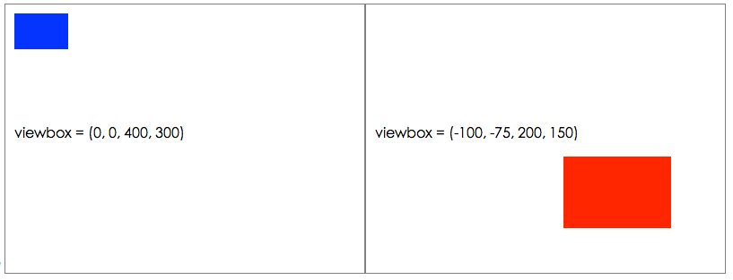

# Kity Graphic : Get Started

本文档内容：

* 

## Paper 的使用 ##

Paper 是所有图形和资源的跟容器，所有图形和资源（资源的概念请参照“Resources”）由 Paper 集中管理。

### 初始化 Paper ###

Kity 中所有的对象都是通过使用 new 运算符创建的，有一些类型要求你在创建的时候传递必须的参数到构造函数中。用下面的代码可以创建一个 Paper，并且会在指定的容器中渲染：

```javascript
var paper = new Paper('container');

// 或者直接传 Dom 对象：
var paper = new Paper(document.body);
```

如果需要，你也可以重新获取容器：

	var container = paper.getContainer();
    
### 设置宽高和视野 ###

宽高和事业是对 Paper 最基本的设置。

宽高指的是 Paper 在浏览器中渲染的大小，可以使用像素或百分比作为单位：

	paper.setWidth(800).setHeight(600);
	// 或使用百分比：
	paper.setWidth('100%').setHeight('100%');

视野定义了 Paper 下图形的坐标系统。由四个值来定义：( x, y, width, height )。其中 x 和 y 确定 Paper 左上角的点再坐标系里的坐标，而 width 和 height 就表示 Paper 显示的坐标范围。



上面两个矩形的大小都是 60 * 40，左上角坐标都是 (10, 10)，但是因为 Paper 的 ViewBox 不一样，导致了其呈现不一样。设置 Paper 的 ViewBox 使用 setViewBox 接口：

	paper.setViewBox(0, 0, 400, 300);

如果需要，也可以获得 Paper 当前的 ViewBox：
	
	/*
		vbox is like: 
		{
			x: 0,
			y: 0,
			width: 400,
			height: 300
		}
	*/
	var vbox = paper.getViewBox();